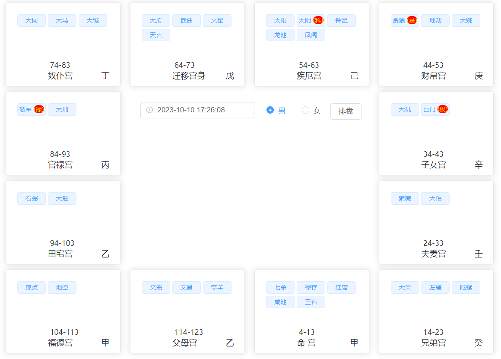
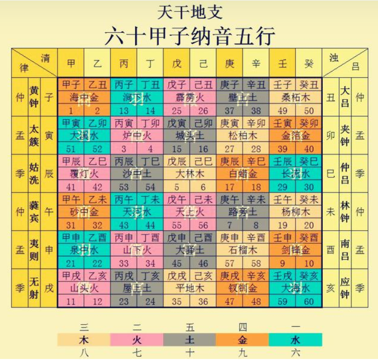
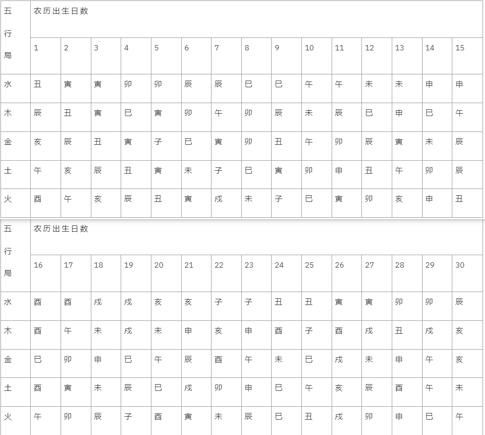

# 项目简介

`ZiWeiDouCountsAstrologicalDivination`是一款简易的紫微斗数排盘工具。

  

# 紫微斗数

> 简介

紫薇斗数是混合天文学、地理学、数学、统计学及合乎逻辑的伦理学，再结合普通的常识和长时间的体验而成一种学问。当初发明的人，是将天上南斗星群、北斗星群、紫薇垣群星及其他的杂星，来象征人的一生遭遇。就是将所生当年月日时，群星的方位躔度排列出来，研究它们相互间的感应。

> 录入星耀

紫微，天机，太阳，武曲，天同，廉贞，天府，太阴，贪狼，巨门，天相，天梁，七杀，破军，天魁，天钺，左辅，右弼，文昌，文曲，禄存，天马，擎羊，陀螺，火星，铃星，地空，地劫，红鸾，天喜，天姚

  

# 排盘方式

目前具体的排盘方式可能会跟世面上的部分排盘程序有所不同，从而导致排出来的盘子会有差异，具体可能会产生差异的点在这里将会进行介绍。

## 定命宫

在地支上由“寅”宫(命盘左下角位置)开始，【顺数生月，逆数生时】定出命宫。

## 定五行局

参考六十甲子纳音表进行确定

## 定紫微星

使用查表法确定

